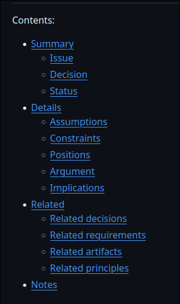

# Genre Detective Prompt

## Purpose
Before professional writers create a document, they need to understand the genre they are working within. In this assignment, you will investigate a professional genre by examining examples of that genre and identifying the conventions that shape how it works.

## Description

Select 2–3 examples of a professional genre that interests you. Your examples might include flyers, newsletters, brochures, FAQs, guides, informational webpages, fact sheets, infographics, promotional materials, or another professional genre.

Analyze your examples to determine what they have in common, how they differ, and how their features respond to audience and purpose.

Your analysis should address:

### Audience

Who is the intended audience?
What does the document assume the audience already knows?

### Purpose

What is the document trying to accomplish?
What does it want readers to think, understand, or do?

### Content

What information is included?
What information is excluded?

### Organization

How is information arranged?
What does the reader encounter first?
How are sections or ideas divided?

Language and Tone

How formal is the language?
What vocabulary or terminology is used?
What tone does the document establish?

### Design

How are headings, images, typography, color, white space, lists, and other visual elements used?
How does the design help readers navigate the information?

### Genre Conventions

Which features appear across multiple examples?
Which features vary?
What seems expected of this genre?

### Conclusion

Conclude by explaining what you have learned about the genre and how that knowledge might influence your own professional document.

Your goal is not simply to describe what the documents look like. Your goal is to explain why the documents are constructed this way and how their choices serve their audiences and purposes.

# Response

An important type of document utilized within software development is the ADR, which is short for _Architecture Decision Record_. This genre of document records both project architectural decisions and their surrounding context in order to preserve the rationale behind an individual decision over the course of a project's life cycle. They are dense technical documents that capture a consequential architecture decision in its entirety, explicitly describing how it will affect the project, other alternatives that were considered, and provide instructions for maintaining the decision in the future.

As the ADR closely follows its subject matter and can be found throughout many differing technical domains, the exact form and audience can vary greatly. This analysis will trace two documents: "Architecture Decision Record: CSS Framework" and "Environment Variable Configuration." They were written by members of a development team for use within their respective projects throughout the planning and development processes.

Depending on an organization's structure, ADRs are not only written for their technical team, but also serve as a record for those who are supporting the development of the project. As a result, they must both be highly specific and informative while still being approachable for the relative layman who may not be as familiar with the project as the authors. The sources are written in a clear declarative style which utilizes plain English, littered with technical terms where necessary, to describe architecture choices and the rationale behind them. They assume a basic knowledge of the overall project as it relates to the subject of the record as well as an understanding of the domain-specific verbiage required to communicate about the subject.

The sources share the inherent goal of properly documenting their specific architectural decision; to that end, their practical goals differ slightly due to their circumstances. "Architecture Decision Record: CSS Framework" records the choice of a CSS framework for a dynamic multi-platform web application, and "Environment Variable Configuration" records the decision for a framework to store application environment variables across differing deployment conditions. These decisions require variation in the information presented in order to fully document their situation, but nonetheless the message is designed to convey an understanding of the environment in which the decision was reached and to capture the logic behind it.

ADRs are broken into multiple different sections that are separated by a bolded header which outlines the topic of a section. Within each section can be either a chart, diagram, bullet point, code snippet, or text. They are purposely designed to be simple, iterative documents often residing alongside source code, and depending on the practices of an organization are managed by the same version control system. A proper ADR system should allow for quick and efficient creation of new ADRs whenever a new architectural decision must be made. They must also be accessible to the entire development team as the decisions that they record dictate the actions and future decisions of the whole team. The document attempts to present its contents as succinctly and quickly as possible through the clear division of information, allowing access to its audience in a rapidly evolving environment.

Both examples share an architecture designed to present an overview of the decision and its surrounding environment, then dive into the unique details of the ADR. They explain the goals of the decisions, their constraints between differing choices, the options that were considered, and then convey the argument behind the final decision recorded in the document ("Architecture Decision Record: CSS Framework"; "Environment Variable Configuration"). After establishing the primary rationale, the sources then evaluate the results, both positive and negative, of the architectural decision. An ADR does not necessarily require an exact format between projects, but they all share one very similar to the examples provided in this analysis. The nature of an ADR allows for variation across the genre in the presentation of information, but every instance retains the same tone of efficient, detailed transfer of information.

Like the many other document genres utilized throughout the complex processes of software development, the ADR is primarily utilitarian. This is observed through the tone, content, and scope of the document. I have previously been unfamiliar with creating and consuming such a brisk, informative manner of writing. Through analyzing and learning about the ADR, I have grown accustomed to the style that is required within a software development environment. When authoring the document for the "Professional Information Product," I will model my work after the professional documents that I have reviewed for this study and ensure that it would be suitable for a software development environment.

## Works Cited

"Architecture Decision Record: CSS Framework." *Architecture Decision Record*, GitHub, github.com/architecture-decision-record/architecture-decision-record/tree/main/locales/en/examples/css-framework.

"Environment Variable Configuration." *Architecture Decision Record*, GitHub, github.com/architecture-decision-record/architecture-decision-record/tree/main/locales/en/examples/environment-variable-configuration.

