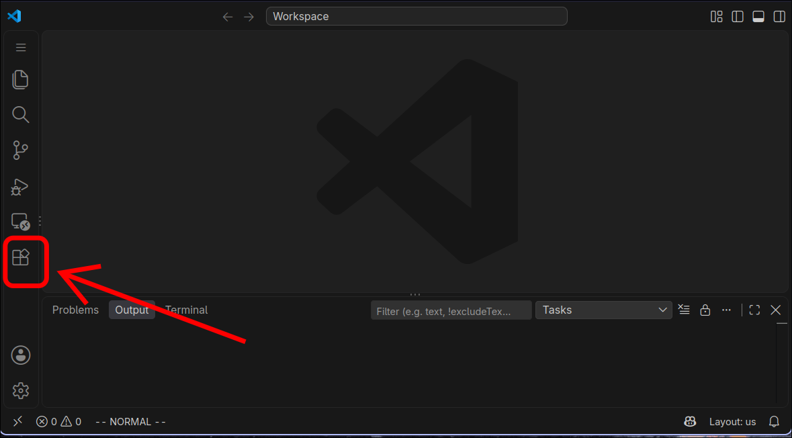
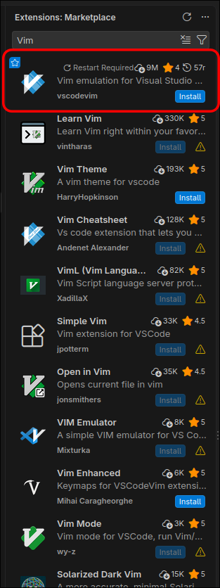
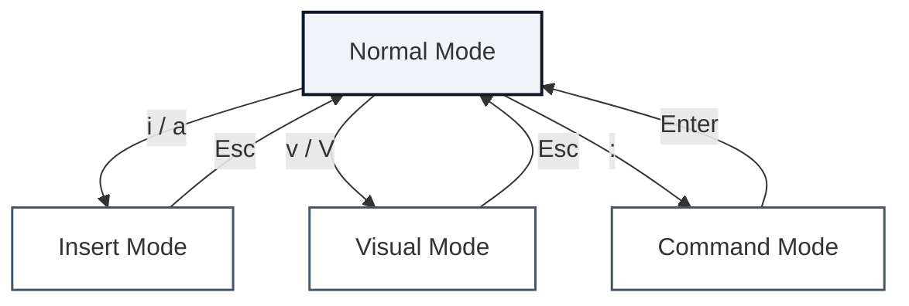

# Vim in VSCode: An Introduction to Vim Motions

* **Target Audience:** UCF Computer Science Students
* **Author:** Owen Lopez
* **Document Genre:** Technical Guide

---

## 1. Introduction: What Does "Vim" Even Mean?
Vim, which is short for Vi Improved, is a widely used code editor designed to be primarily utilized through the keyboard.  The program was written as an evolution of an ancient code editor named _Vi_.  Released in 1991 by _Bram Moolenaar_, Vim is distinct compared to traditional editors due to it's philosophy of **Modal Editing**.  By utilizing this unique methodology within the familiar environment of VSCode this guide will jump-start your ability to produce code in a manner previously unachievable.

> **Note:** While modal editing might initially appear unfamiliar, it is common in numerous varying genres of creative software such as: _Photoshop_, _Adobe Aftereffects_, and _Blender_.

Modal editing is the concept of editing data through utilizing specific tools, or modes.
These modes all transform their respective mediums in different manners, allowing users to perform the exact alterations that they desire.
A mode can be as simple as the paint brush tool in an image editor or as complex as _Blender's_ Transform Operator.
In contrast, the traditional text editor only performs one action when a user interacts with it's medium of text, that is inserting or removing text.

For this guide we will be installing a plugin to the popular editor VSCode.
There are many different ways to access the capabilities of Vim, but for simplicity the vim extension will serve as an excellent starting point to your Vim journey.
Instead of entering text into native Vim though, it'll be received by the VSCode environment.
This extension will essentially replicate how control & input function within the Vim application, without any of the typical terminal Vim baggage.

Please follow along to the following instructions presented.
Vim, like any other tool, requires an initial amount of practice to begin using it in your everyday programming.
Thus, you will benefit greatly by performing my instructions as I introduce the application.
Once you do get the hang of it, you'll see just how incredibly efficient one can get through practice and determination.

---

## 2. Installation & Setup in Visual Studio Code

### Step 1: Open the Extensions Marketplace

To begin, we must download the Vim extension from the marketplace.
In the left sidebar, click on the lowest icon. 
It will look like four squares in a grid, with the top right corner rotated slightly.
This is where you can install numerous extensions that enhance the capabilities of VSCode.



*Fig. 1. Visual Studio Code Activity Bar indicating the Extensions Marketplace icon.*

---

### Step 2: Search and Install VSCodeVim

Once you have opened the menu, you will see a search bar on the top of the panel.
Click on the search bar, type in "Vim", and hit 'enter'.
Once the results have loaded you'll want to find the extension labeled 'Vim', with the subtext of 'Vim emulation for Visual Studio Code'.
It will have a blue background and a large white 'V' as the logo.
Then click the blue install button that is on the bottom right of the extension.
There will be many different options that that look similar at first glance, but do not worry about those.
Just install the extension I have shown in this guide and you will have all the capabilities of Vim at your fingertips.



*Fig. 2. Extensions Marketplace search results highlighting the official VSCodeVim package.*

> **Warning!** Once installed, VSCodeVim activates immediately without requiring an editor restart. Your editor will now behave like Vim, so be prepared to be unable to edit code in the traditional manner.

---

## 3. The Modal Architecture

A modal architecture requires the user to swap through many different modes, each with differing behavior, throughout a session.
Each mode is designed to perform a specif type of action, like mass editing of a large sections document or precise character input in a single sentence.
In a image editing program, the user switches modes and selects tools by clicking on buttons with a mouse.
While intuitive and easy to learn for newcomers, this methodology does not properly utilize the efficiency presented by the keyboard.
The mouse primarily has three buttons for a user to operate their program, while the keyboard can have up to 104!
Each button can be pressed in a near equal amount of time and effort from the user.
This allows for an enormous range of actions to performed on each key press.
Using this philosophy a power user can manipulate his document in the exact manner in which he desires, in a rapid fashion, all without ever having to slow down by reaching for the mouse.

To switch modes in Vim, you must first be in the 'NORMAL' mode, and then hit the specific key tied to your desired mode.
To return to NORMAL mode either hit the 'Escape' key or Ctrl-C.
Each key performs a different action depending on the user's selected mode.
The mode is displayed in a status bar at the bottom of the screen.

### Core Editing Modes

* **Normal Mode:** The default state of Vim. All keypresses are interpreted as navigation or manipulation commands rather than literal characters.
* **Insert Mode:** The traditional editing mode where keys that are typed are placed on the screen, as compared to controlling the program.
* **Command-Line Mode:** A special mode that allows users to enter powerful commands. Entered by pressing `:` from NORMAL mode.
* **Visual Mode:** Used for highlighting text over multiple lines, it replaces selecting text by dragging the mouse. Entered by hitting `v` which highlights individual characters or 'V' which highlights an entire line.



```text
                         ┌─────────────┐
            ┌───────────>│ Normal Mode │<───────────┐
            │            └───┬───┬───┬─┘            │
      <Esc> │        i / a ┌─┘   │   └─┐ :          │ <CR> / <Esc>
            │              │ v/V │     │            │
            │              v     v     v            │
     ┌─────────────┐ ┌─────────────┐ ┌─────────────┐│
     │ Insert Mode │ │ Visual Mode │ │Command Mode ││
     └──────┬──────┘ └──────┬──────┘ └──────┬──────┘│
            │               │               │       │
            └───────────────┴───────────────┴───────┘
```

*Fig. 3. Vim modal architecture state transitions and keybindings.*


---

## 4. Navigation

In order to navigate without utilizing the mouse, you must use the keyboard in normal mode to move the cursor.
Each key in normal mode performer a function, but it is not necessary to know the behavior of every single key.
We're going to cover the keys fundamental to basic movement through your document.
It is essential that you place your hands in the _Touch Typing_ position, with each index finger on 'f' and 'j'.

| Keystroke | Movement Direction | Functional Description |
| :--- | :--- | :--- |
| `h` | Left | Moves cursor one character left. |
| `j` | Down | Moves cursor one line down. |
| `k` | Up | Moves cursor one line up. |
| `l` | Right | Moves cursor one character right. |
| `w` | Word Forward | Advances cursor to the beginning of the next word. |
| `b` | Word Backward | Moves cursor backward to the start of the previous word. |
| `f` | Find | Jumps directly to the character specified after. Holding shift jumps in the reverse direction. |
| `0` | Line Start | Jumps directly to the first character of current line. |
| `$` | Line End | Jumps directly to the last character of current line. |
| `gg` or `go` | File Top | Moves cursor immediately to the first line of file. |
| `G` | File Bottom | Moves cursor immediately to the last line of file. |

> **Go Practice!** Take the time now to practice your navigation in a document. There is an initial learning curve, but once you have practiced the movements a couple times navigation with the keyboard will feel completely natural.

---

## 5. Editing

Now that you've learnt to navigate a throughout a document, we must now start editing it.
There a couple of important commands for editing in normal mode, but not nearly as many as those required for moving the cursor.
Importantly, hitting 'i' or 'a' will place you into insert mode, the former to the left of your cursor and the latter to the right your cursor.
If you hold shift while using them your cursor will jump to the beginning or end of the line respectively.

| Keystroke | Operator Action | Operational Scope |
| :--- | :--- | :--- |
| `x` | Delete Character | Deletes single character directly under cursor. |
| `dd` | Delete Line | Cuts current line into default clipboard register. |
| `yy` | Yank (Copy) Line | Copies entire current line without modifying text. |
| `p` | Put (Paste) | Pastes copied/deleted text immediately after cursor. |
| `u` | Undo | Reverses the most recent editing action. |
| `<Ctrl-r>` | Redo | Reapplies changes previously reversed by undo. |
| `r` | Replace Character | Replaces single character under cursor with next keypress. |

> **Note:** The operator 'u' will be your _best friend_. If you ever accidentally hit a key, or made a mistake, just hit 'u' as fast as possible. It is common to make many mistakes while learning, so do not be afraid to utilize undo as often as possible.

---

## 6. Operator Combination

Now we have covered the skills required to edit a document, everything presented in the following sections is designed to increase your efficiency exponentially.
The final core component of the Vim philosophy is that **you can chain operators together**.
Almost every operator is designed to be paired with another of the same type, ie: navigation, editing, or control.
This concept requires a couple of examples to fully grasp its power.
The simplest use of this behavior is by utilizing numbers with movement keys.

In NORMAL mode, hit a number key and then hit a movement key (h, j, k, l).
Your cursor will be moved as many times as the value of the number.
You could even paste 100 times in one button press if you wanted to!
This applies for any other command in normal mode, you can use them repeatedly for any arbitrary number.

The real efficiency boon comes from chaining selection commands (w, b, $, or t) and editing commands like 'd' or 'c'.

>**Note** The 'c' key, which represents the _change_ action, will remove a selected piece of text and place the user in insert mode. Essentially allowing them to change whole words or sentences in just two keypresses.

| Chain | Operator Action | Operational Scope |
| :--- | :--- | :--- |
| `dw` | Delete Word | Deletes an entire word, starting from the cursor. |
| `cw` | Change Word | Deletes a word and places the user in INSERT mode. |
| `5i` | 5x Insert| Will paste whatever text is typed in insert mode 5 times. |
| `db` | Delete Back | Deletes behind the cursor to the start of a word. |
| `d$` | Delete To End Of Line | Deletes to the end of a line. |
| `ct{key}` | Change to Character| Deletes up to a character, then places the user in INSERT mode. Using this to a period allows for lightning fast editing of a sentence. |
| `ci{key}` | Change in Character| Deletes all content surrounded by character, then places the user in INSERT mode. |

---
